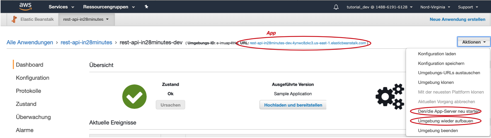
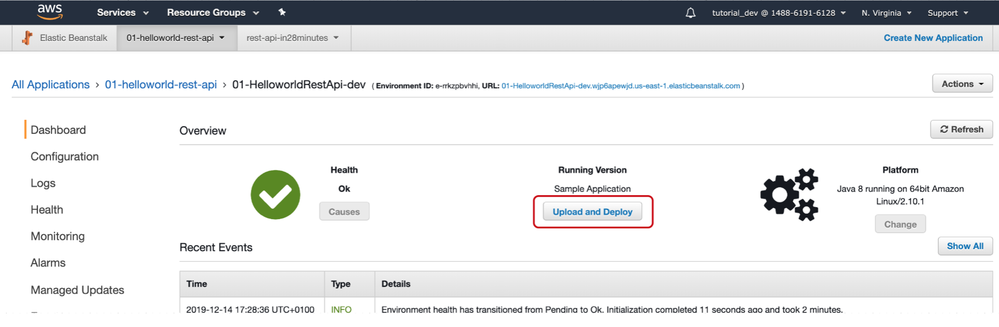
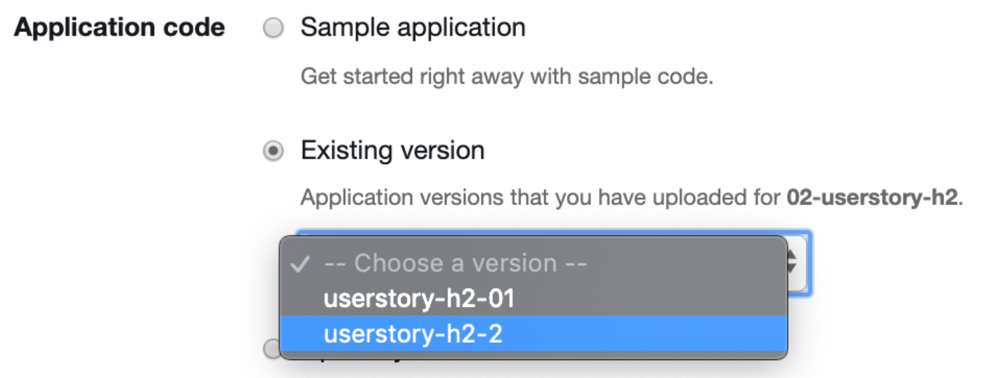
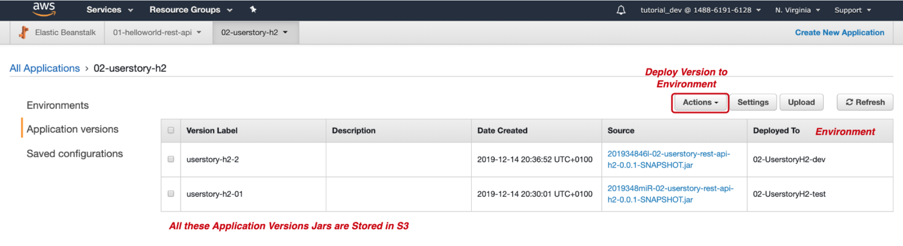

# Deploy Sample Application

### Login 
with IAM user

### Region
US East N. Virginia

### Create New Application
Services -> Elastic Beanstalk
-> Create App
Name: rest-api

### Create Environment
Dev, Stage, Prod, …  
Web server Environment (for Webapps), Worker Environment (for Batch Jobs)  
Platform: Docker, .jar -> Java, .war -> Tomcat  
-> Create  
Name: “rest-api-dev”  
Use “Sample Application”

## Terminate Environments!
Unused Environments should be terminated. Otherwise fees may apply if usage exceeds.

### Delete Application
nothing can be restored  
Terminate Environment  
everything can be restored within 6 weeks  
Terminated environment is visible for 1h, after that:
Actions -> Restore Terminated Environment

# Deploy JAR Manually

### Create New Application
Name: 02-userstory-h2

### Create Environment
Name: 02-UserstoryH2-dev  
Platform: Java

#### Upload  
Version label: userstory-h2-01

# Deploy WAR Manually

### Create Environment
Platform: Tomcat  
Upload Your Code: upload war file  

## Enable H2 Console
spring.h2.console.settings.web-allow-others=true  

## Info
Reverse Proxy: is Apache HTTP Proxy, and no longer nginx  
Logs: tomcat8 folder contains application logs

# Create TEST Environment
Name: 02-UserstoryH2-test  
Platform: Java  
Dev -> Test

# Application Versions
Track, which Version is deployed to which Environment

### Deploy Application versions to any Environment
Select Version  
Actions -> Deploy

# Logs
Download full logs of an Environment

### Health
A health ***daemon*** is consistently running, checking the health of the instance

### nginx
Reverse Proxy  
Logs all requests

### Rotated
Contains all earlier logs

### “cfn” Log Files
Cloud Formation Logs about Creating & Updating the Environment

### “web” Log Files 
Spring Boot Logs