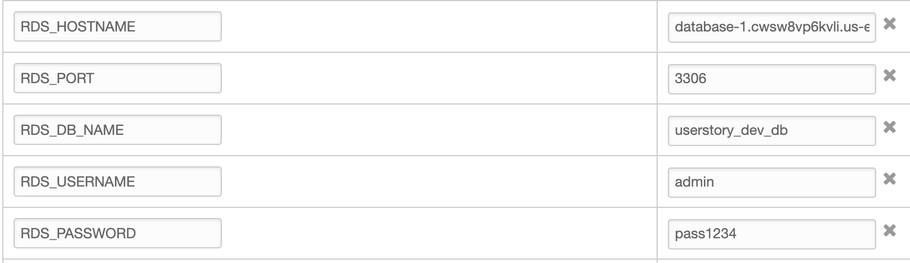
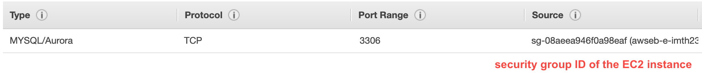
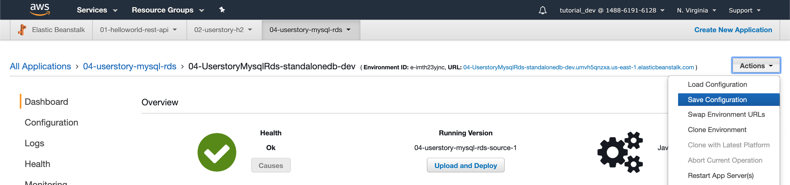
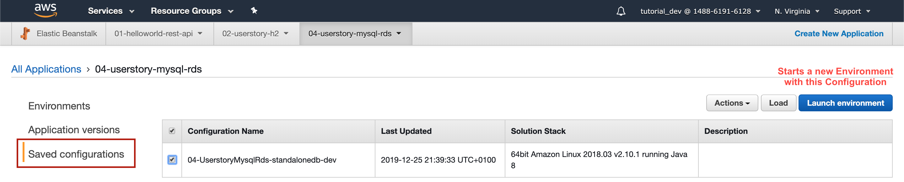

# Persistence - Amazon RDS (Relational Database Service)

### Create app with MySQL
- Local Connection: mysql docker  

### Create New Application
- Name: 04-userstory-mysql-rds

### Create Environment
- Name: 04-UserstoryMysqlRds-dev  
- Upload Jar  

### Configure more options
- Database
- Username	: devUser
- Password	: pass1234
- Retention	: Delete (DB is deleted when Environment is destroyed)
- Availability	: low  
- -> Save  
- -> Create Environment

## RDS Environment Variables
`RDS_HOSTNAME`
`RDS_PORT`
`RDS_DB_NAME`
`RDS_USERNAME`
`RDS_PASSWORD`  
are automatically set by Elastic Beanstalk, no manual Environment configuration necessary

## Problem with RDS via Elastic Beanstalk
RDS is tied to the Lifecycle of the Elastic Beanstalk Environment

# Create RDS outside Elastic Beanstalk
Advantage: DB has its own lifecycle, independent
from Environment

### Create Database
- Services -> RDS -> create Database
- Engine: MySQL
- Templates: Free Tier
- DB instance identifier: userstory-rds
- Master Username: admin
- Master Password: pass1234
- initial DB name: userstory_dev_db

### Create Environment without Database
- Name: 04-UserstoryMysqlRds-standalonedb-dev  
- Upload Jar 

### set Environment Variables
- Environment -> Configuration -> Software

### configure Security Group rules
Add Security Group ID of the EC2 instance to 
the Inbound Rules of the DB Security Group

- Actions -> Restart App Server

## Terminating
Environment cannot be terminated.
Elastic Beanstalk manages the Security Group of the EC2 Webserver instance.
When terminating the Environment, EB deletes this Security Group and
also tries to terminate the DBs Security Group. This
produces an error.

# Create own Security Group

- EC2 -> Network & Security -> Security Groups
- Security Group Name: userstory-webapp-ec2-dev-sg
- Security Group ID: auto generated

### Use new Security Group in DB inbound rules
like above

### Assign new Security Group to EC2 webapp
- Environment -> Configuration -> Instances
- Add the new Security Group

# Save Environment Configurations
including Databases, Security Groups, Environment Variables, etc.

