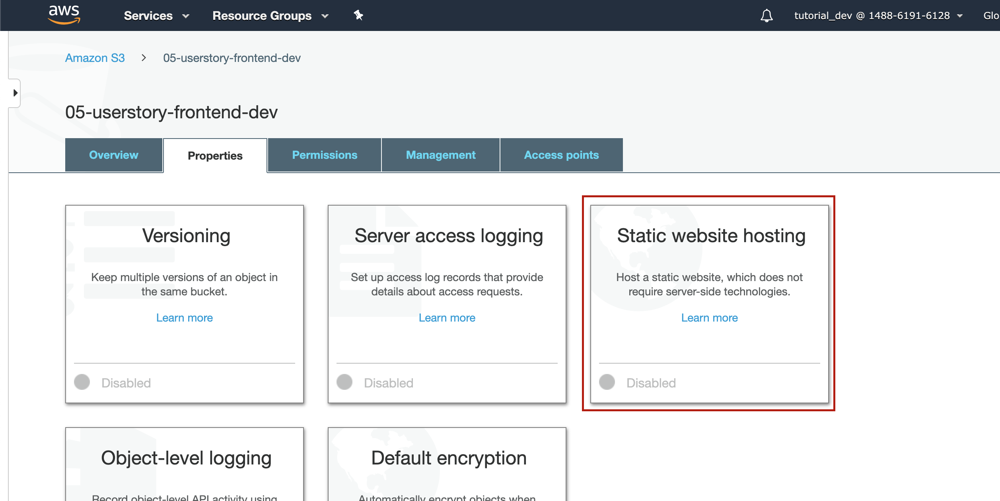
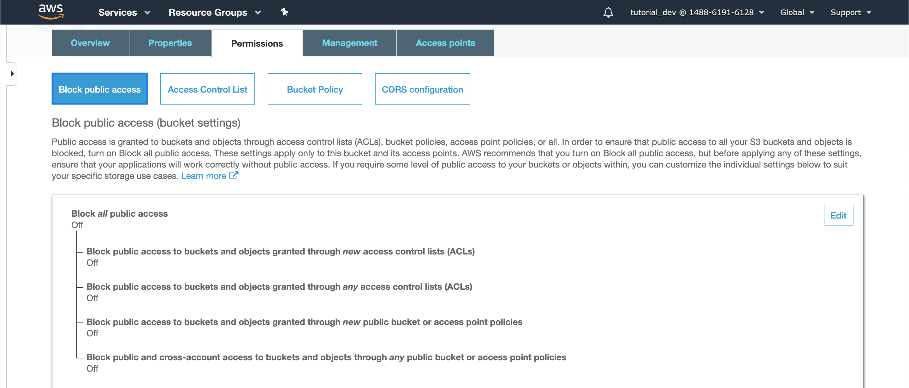

# Deploy Backend
standard Elastic Beanstalk deployment

create Application, Environment and upload JAR

# Deploy Frontend

## Create build

#### Backend URL
change api url in frontend services to use
AWS Environment url

#### create production build
`$ npm run build`

build output is placed under /build

## Deploy to S3
S3 can be used to serve static content

Bucket needs to be in the same _**Region**_ as the EB Environment

#### create Bucket
- Services -> S3 -> Create Bucket
- Bucket Name: 05-userstory-frontend-dev
- Region: US East (N. Virginia)
- Take defaults for the remaining and create Bucket

#### Upload Frontend sources
upload the contents of the /build directory

#### setup Webserver



- Index document: index.html
- Error document: error.html (optional)

#### Make Website public

##### turn 'Block Public Access' off



##### add bucket policy

```json
{
    "Version": "2012-10-17",
    "Statement": [
        {
            "Sid": "AddPerm",
            "Effect": "Allow",
            "Principal": "*",
            "Action": "s3:GetObject",
            "Resource": "arn:aws:s3:::05-userstory-frontend-dev/*"
        }
    ]
}
```
allow access to all principals (users) to 
execute getObject on the resource 'arn:aws:s3:::05-userstory-frontend-dev'

## DOES NOT WORK, EC2 RETURNS 403 (Forbidden) FOR REQUESTS FROM S3