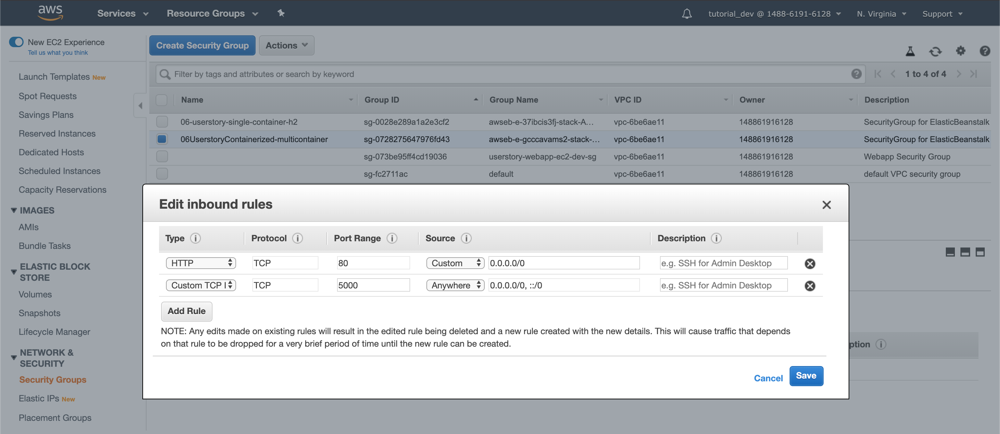

# Info
Deploy 2 Docker containers (App & Mysql) to one AWS instance

## Run Local Mysql Docker
```shell script
$ docker run --detach \
  --env MYSQL_ROOT_PASSWORD=root \
  --env MYSQL_USER=thomas-local \
  --env MYSQL_PASSWORD=pass1 \
  --env MYSQL_DATABASE=userstory \
  --name mysql-container \
  --publish 3306:3306 mysql:5.7
```

### MySQL CLI
`$ docker exec -it mysql-container mysql -u thomas-local -p`

password: pass1

## Run App direct
**Run Argument:** MYSQL_HOST=localhost

`$ mvn spring-boot:run -Dspring-boot.run.arguments=--MYSQL_HOST=localhost`

or via **Run Config**
- Program Arguments: --MYSQL_HOST=localhost

## Run App Local Docker
`$ mvn clean install`

`$ docker run -p 8080:5000 --link mysql-container:mysql ttt9912/06-userstory-multi-container-mysql:0.0.1-SNAPSHOT`

## Browser
- Local run: port 5000
- Docker run: port 8080

`$ curl localhost:<port>/userstories | json_pp`

```shell script
$ curl -v -X POST localhost:<port>/userstories \
    -H "Content-Type:application/json" \
    -d '{"username": "paul", "description": "Learn JPA", "targetDate": "2019-12-14", "isDone": false}'
```

```shell script
$ curl -v -X PUT localhost:<port>/userstories \
    -H "Content-Type:application/json" \
    -d '{"id": 10, "username": "peter", "description": "Learn AWS", "targetDate": "2019-12-14", "isDone": true}'
```

## H2 Console 
try it on deployed app

`localhost:<port>/h2-console`  

JDBC URL: `jdbc:h2:mem:testdb`


# Deploy Multiple Images to one Instance
Note: deploying Mysql DB as Container is not ideal since 
Containers should be able to be recreated

## Link & Run Containers
Note: link is deprecated!


#### Run MySQL container

#### Run App Container
Link App Container to MySQL Container

App does now access MySQL on 
`jdbc:mysql://mysql-container:3306/userstory`

## AWS
update Dockerrun.aws.json to configure both containers

### create new Application & Environment
- create Environment
- Platform: Multi-container Docker
- upload Dockerrun.aws.json file

### Template
https://docs.aws.amazon.com/elasticbeanstalk/latest/dg/create_deploy_docker_v2config.html

## ECS - Elastic Container Service
AWS uses ECS in the background for Multi container deployments

## No Reverse Proxy
No Reverse Proxy is present in Multi container deployments. 
Application starts fine but is not accessible via browser.

### Open Access to a Container Port
```shell script
{
    "hostPort": 5000,
    "containerPort": 5000
} 
```

lets the EC2 Instance expose port 5000, but the
**Security Group** of the EC2 instance prevents traffic on port 5000

#### Configure Security Groups
Services -> EC2 -> Security Groups -> pick the one responsible for the corresponding Environment



Traffic is allowed on port 80 by default.
Add port 5000.

### Browser with port 5000
http://06-userstory-multicontainer-mysql.pd4mujhmpi.us-east-1.elasticbeanstalk.com:**5000**/userstories


