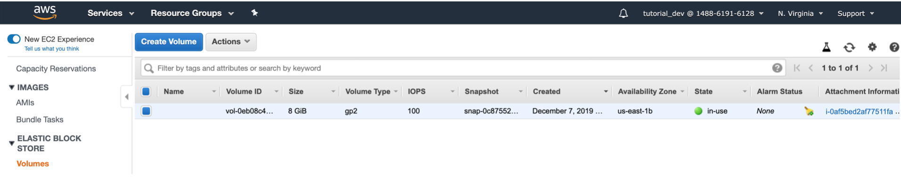

# The Cloud
Most important feature of the Cloud: **On Demant Resource Provisioning**

# AWS Users

### Create IAM User
Management Console -> Services -> type “IAM”

#### Create Group “Developers”

#### Give Policies to “Developers”
- AWS Managed Policies
- Add “AdministratorAccess”

### Create User “tutorial_dev”
tutorial_dev/pass1

### AWS access Types
- Programmatic (to API with keys)
- AWS Management Console (can login to Management Console)

#### Assign Group “Developers” to User “tutorial_dev”

#### Finish & Login

# Elastic Beanstalk
There are tons of services… 
EB helps getting started to deploy an app to the cloud

Helps do deploy a variety of applications (Java, Python, NodeJS, …) to a variety of platforms (Tomcat, …)

#### Background Services & Features
EC2, RDS, DNS, Elastic IP, Security Groups, S3, …

# Application

## Environment
Dev, Stage, Prod, … 

#### Web Server Environment
for Webapps

#### Worker Environment
for Batch Jobs

### Platform
- Docker
- Java (.jar)
- Tomcat (.war)
- ...

### Application Code
- Sample Application
- Existing Version: earlier uploaded artifacts to this Application
- Upload your Code: upload .jar, .war, Dockerrun.aws.json, ...

#### Version Label
given for every upload

### Environment Configuration

#### Environment Variables
JAVA_HOME etc.

#### Instances

##### Monitoring 
Amazon CloudWatch

#### Capacity
Single instance / Load balanced

##### Instance Type
“t2.micro” (Free)  
Instance types, configuration, pricing: 
- t2 instances: https://aws.amazon.com/de/ec2/instance-types/t2/

#### Security Groups

#### Tags
Identify the environment of a specific type (e.g. “dev”, “test”, etc.)

### Terminate Environments!
Unused Environments should be terminated. Otherwise fees may apply if usage exceeds.

# Managed Services

## EC2
- Elastic Compute Cloud
- Virtual Servers on which the application is deployed
- EC2 is Web Service to obtain virtual resources & services in the cloud

### Instances
  
(instance of the demo app)

### Volumes
Hard Disk which is attached to the Virtual Server (“Attachment Information” points to Instance ID)

#### Elastic Block Store
Hard Disk

### Security Groups
Configure, what kind of traffic is coming into and is going out of the Instance

#### Inbound Rules

Allow TCP Traffic with HTTP on Port 80 (enables to access the App via Browser)

#### Outbound Rules

#### Enable Connections between Instances
Example:  RDS instance to allow MYSQL connections from Webserver instance

##### Webserver Instance Security Group
Services -> EC2 -> instances -> security group

##### RDS Security Group
Services -> RDS -> DB instances -> security group

##### RDS Security Group Inbound Rules

- Enable TCP Traffic on Port 3306 from Source: sg-043550ef445d7085e (= EC2 instance Security Group)
- Enables connections only from EC2 instance
- Add a new rule to enable connections from another place (e.g. MySQL shell, Workbench, …)

### Elastic IP
Everytime the Elastic Beanstalk Environment is rebuilt, a new IP address gets associated with this specific instance.

Elastic IP provides a static IP for the Environment

With this, an EC2 Instance can have a **public DNS** name and a **public IP** address

### Load Balancer
### Auto Scaling
### S3 Jar store

### EC2 Configurations
- Memories
- CPUs
- Storage
- Network capacity

### Pricing
Charged by the amount of time they are running

## RDS
Relational Database Service

## S3
Storage for all kinds of data that are not a relational database

S3 is global, does not belong to a Region

#### S3 Website Hosting

# Regions
AWS Global Infrastructure
https://aws.amazon.com/de/about-aws/global-infrastructure/

### Reasons
- Performance: Servers are faster when they are closer to the Requests
- Availability

# Billing

### Check Billing Dashboard

### Free Tier
https://aws.amazon.com/de/free/?all-free-tier.sort-by=item.additionalFields.SortRank&all-free-tier.sort-order=asc

### Pricing (what do services cost)
https://aws.amazon.com/de/pricing/

## Alerts

#### Receive Notifications
Account -> Billing Dashboard -> Billing preferences

### Define Alerts with CloudWatch

- Metric: Billing -> EstimatedCharges

- Conditions: Greater 0 USD
- Create a new topic: Billing_CloudWatch_Alarms_Topic

- Email endpoints that will receive the notification: blabla@gmail.com

- -> Create Topic

## Budgets

### Define Budgets & Alerts with AWS Budgets
- Services -> AWS Budgets
- Create a Budget (Cost Budget)
- Monthly
Budget Amount	: $1

#### Configure alerts

## Tipps
Minimize uptime, always stop resources, when they are not used
